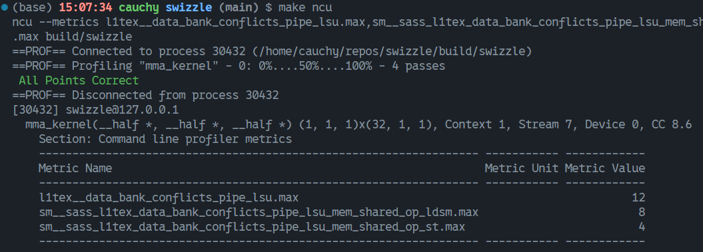
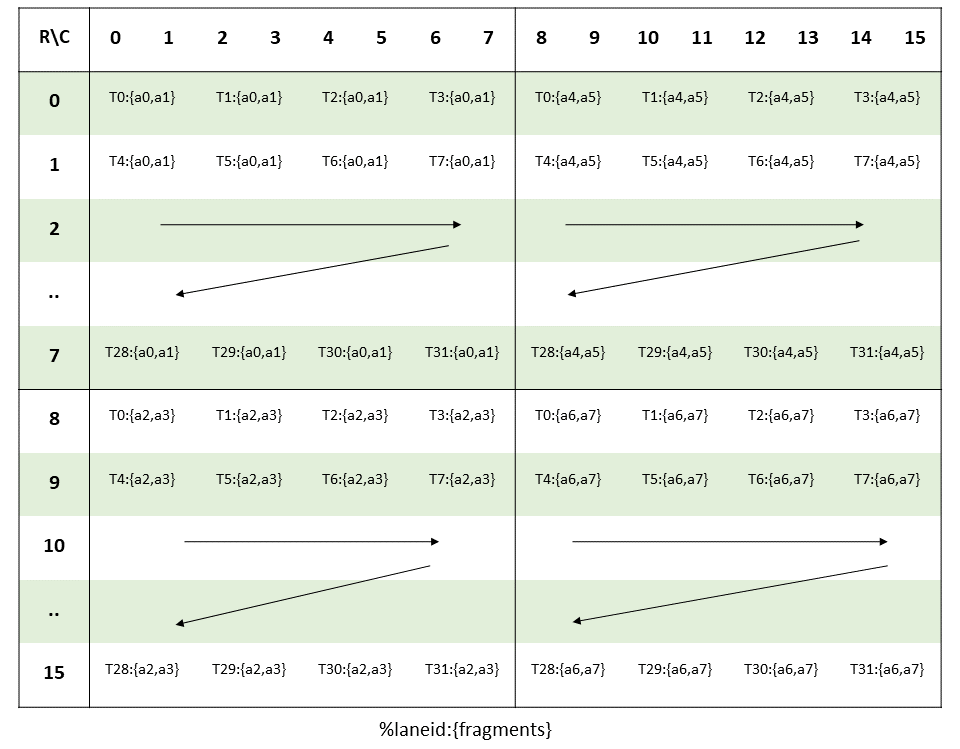
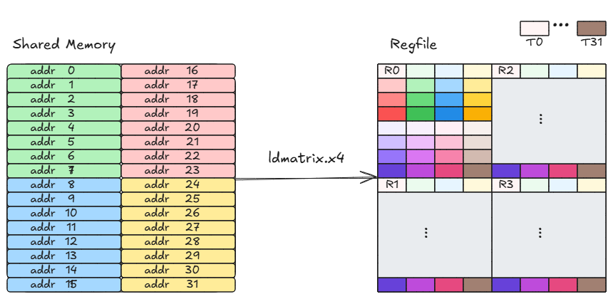
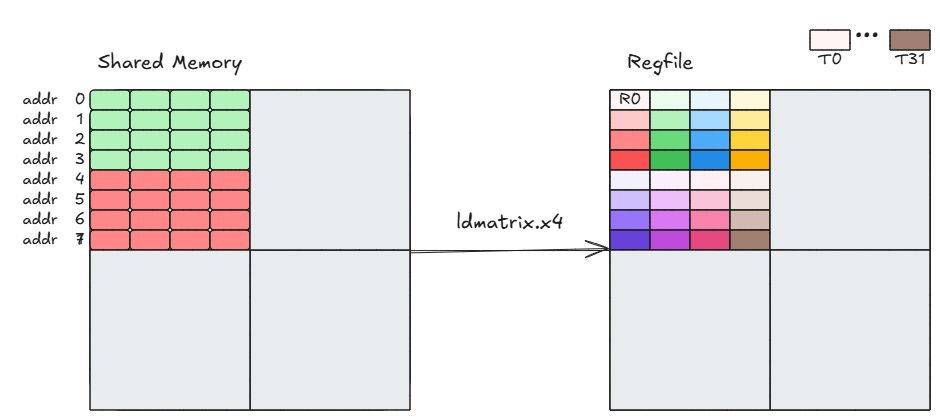
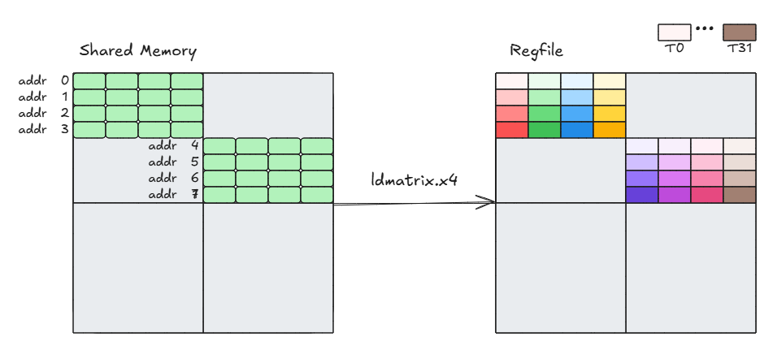
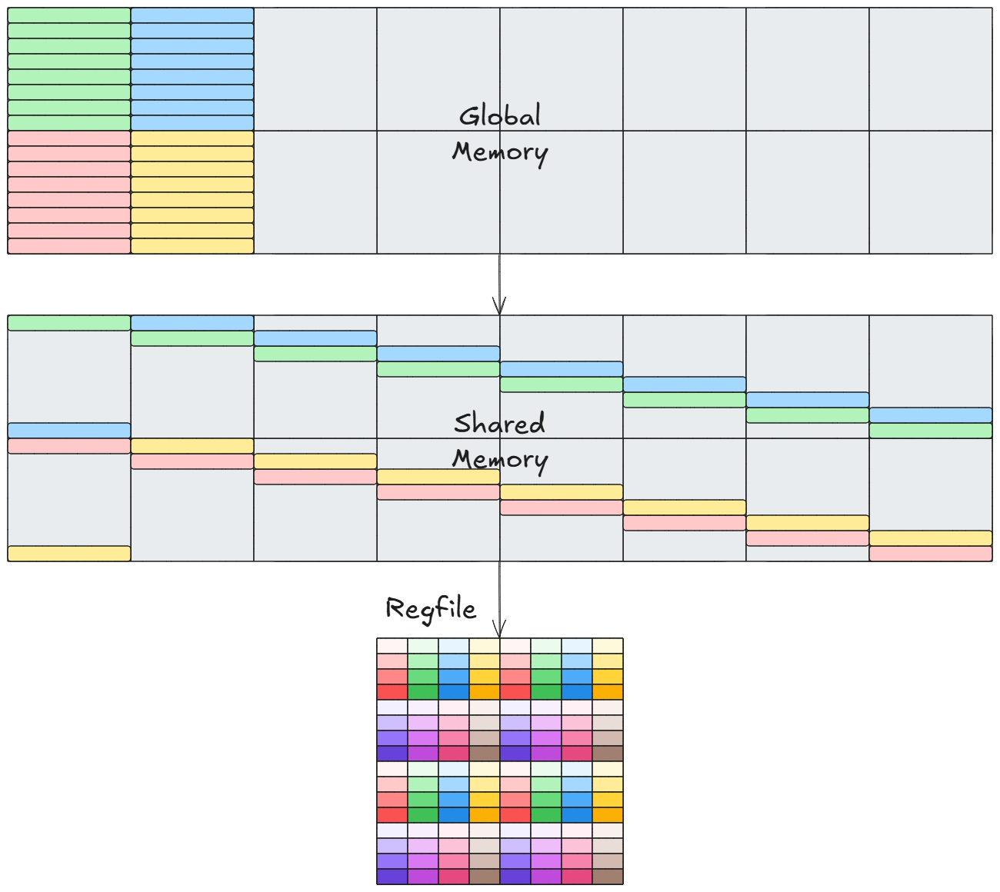
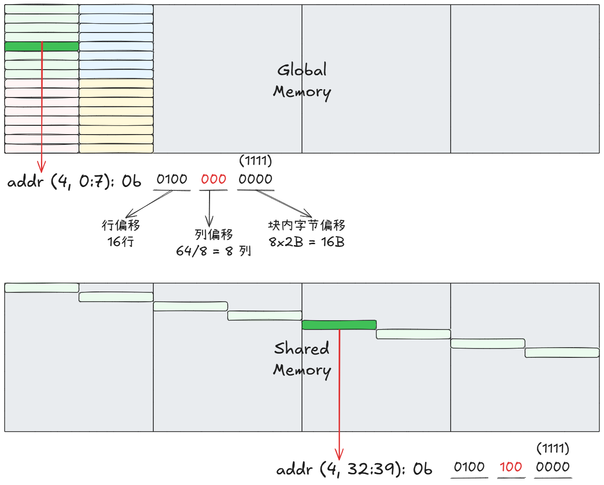
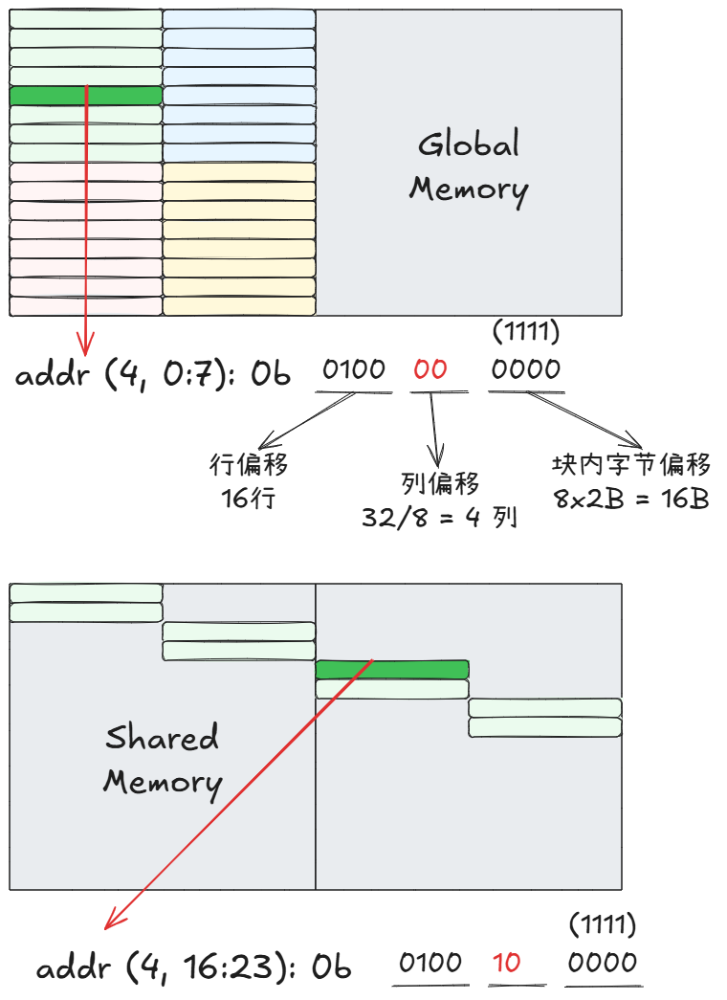

# 实用 Swizzle 教程
实验仓库地址: https://github.com/Chtholly-Boss/swizzle
## 前言
最近科研工作中需要使用 Tensor Core 进行算子优化，在优化过程中发现了大量的 **Bank Conflict**，感到十分苦恼。听说 **CUTLASS** 提出了一种 **Bank Conflict Free** 的 **Swizzle** 技术，感觉很高大上，遂进行了高强度的 RTFM 和博客阅读。
Zhihu 上对于 Swizzle 的讲解已有了不少的优秀的文章，笔者看完后感觉十分长脑子，但在落地的时候我的手跟我说他还没学会，他对以下几点感到十分苦恼：

- 他不想使用 CUTLASS 库，因为还不会
- 他不知道从哪里写起，大部分博客没代码抄，或者有代码，但调的 CUTLASS

笔者对他感到十分失望，遂经过两三天的实验后，为他写下了本文，试图教会他 **怎么将 Swizzle 技术应用到算子中以消除 Bank Conflict**

## 问题的产生
Swizzle 能解决 Bank Conflict，但哪里来的 Conflict 呢？这就要从我们最开始的目标说起，即 “使用 Tensor Core 进行算子优化”。具体来说，在查阅 [CUDA Programming Guide 7.24](https://docs.nvidia.com/cuda/cuda-c-programming-guide/index.html#warp-matrix-functions) 后我们知道可以通过如下的方式调用 Tensor Core API 完成一次 `(m,n,k) = (16,16,16)` 的 `C = A B^T` FP16 矩阵乘法：

```Cpp
__device__ void mma_simple(half *a, half *b, half *c) {
    using namespace nvcuda::wmma;
    fragment<matrix_a, 16, 16, 16, half, row_major> a_frag;
    fragment<matrix_b, 16, 16, 16, half, col_major> b_frag;
    fragment<accumulator, 16, 16, 16, half> c_frag;

    load_matrix_sync(a_frag, a, 16);
    load_matrix_sync(b_frag, b, 16);

    fill_fragment(c_frag, 0.0f);

    mma_sync(c_frag, a_frag, b_frag, c_frag);

    store_matrix_sync(c, c_frag, 16, mem_row_major);
}
```

关于函数的具体使用说明可直接查看 [CUDA Programming Guide 7.24](https://docs.nvidia.com/cuda/cuda-c-programming-guide/index.html#warp-matrix-functions)。

这看起来似乎很友好，于是我兴奋地写好了测试代码后一顿操作猛如虎进行了 profile，得到了如下结果：


Emm..., 如图所示，Global Load/Store 均不造成 bank conflict，那么这里的 12 次冲突是哪来的呢？我们在调用 `mma_simple` 的时候一般是从 Shared Memory 加载/存储数据（笔者的测试也是如此），因此合理推断是 mma 的相关操作产生了冲突。

通过反汇编查看 SASS 代码，我们可以知道 `load_matrix_sync` 生成了 `LDSM` 指令，`store_matrix_sync` 生成了 `STS` 指令，由此我们可以查看对应指令造成的冲突。



很好，我们成功地找到了罪魁祸首。因此现在的问题转为如下两个：

- `load_matrix_sync` 是怎么使用 `LDSM` 的？
- `store_matrix_sync` 写入的模式是怎么样的？

### LDSM 指令
为解决前述问题，在一顿对 AI 的拷打以及 RTFM 之后，我们知道与 `LDSM` 相对应的 PTX 指令有 `ldmatrix`，查阅 [PTX ISA 9.7.14](https://docs.nvidia.com/cuda/parallel-thread-execution/index.html#warp-level-matrix-multiply-accumulate-instructions) 可以了解到指令的相关信息，对于我们的问题来说，只需要关注 `ldmatrix.sync.aligned.x4.m8n8.shared.b16{.trans} r, [p];` 的用法即可。

该条指令的基础版本为 `ldmatrix.sync.aligned.x1.m8n8.shared.b16` ，从指令名可以看出其作用为加载一个 8x8 矩阵。这时候就有读者要问了：

- 为什么需要这条加载指令？有普通的 Load 指令不就够了吗？

事实上，从该指令在手册中所处的位置也可以知道，`ldmatrix` 是为 Tensor Core 的矩阵计算而生的一条加载指令，为使用 HMMA 指令利用 Tensor Core 进行矩阵乘法计算，矩阵的元素需要 **分布存储** 到一个 warp 的 32 个线程中。以一个 16x16 FP16 矩阵为例，由于每个 32 位寄存器可以存两个 FP16，每个线程各提供 4 个寄存器 `R0, R1, R2, R3` ，共同存储 `32 * 4 * 2 = 256` 个矩阵元素。
为利用 HMMA 指令进行计算，在官方手册中要求矩阵的元素与线程的各个寄存器有一定的对应关系，以矩阵 A 为例，该对应关系如下所示：



其中 `{a0,a1}` 表示寄存器中存储原矩阵的 `a0, a1` 元素。

由该图可知，如果我们要用正常的 Load 指令将数据加载到寄存器，需要 4 条指令，但如果使用 `ldmatrix.sync.aligned.x4.m8n8.shared.b16 {%r0, %r1, %r2, %r3}, [%addr];` 则只需一条指令，很大程度上减少了 Issue 的指令数。

`ldmatrix` 的 `.x{1,2,4}` 修饰符用于指定加载多少个 8x8 矩阵，每个矩阵的 8 个行的地址用对应线程给出，如 `thread0-7` 给出的 8 个地址用于加载第一个 8x8 矩阵到 warp 内各线程的 `R0` 寄存器中，`thread8-15` 给出的 8 个地址用于加载第二个 8x8 矩阵到 warp 内各线程的 `R1` 寄存器中... 该过程在实际运行中应当是分 4 阶段进行的。

`load_matrix_sync(frag_a, smem_a, 16)` 对该指令的使用方式可用下图说明：



该过程为 Warp 级别的协作过程，

### STS 指令
STS 即 st.shared, 表示将寄存器的内容存到 shared memory 中。由于该指令处理的是结果矩阵，因此需要关注结果矩阵的布局。在 sm90 后结果矩阵的存储也可能使用 `stmatrix` 指令，由于思路都差不多，本文重点关注 Load，读者可根据需要决定是否对 Store 过程也进行优化。

### Bank Conflict 
观察 `ldmatrix` 的第一个阶段，如下图所示：



由于共享内存共有 32 个 4B 的 bank，我们可以知道 16x16 FP16 矩阵的 4 行刚好占满所有 bank，因此在第一个阶段的加载中，会有如上图所示的冲突。

每个 16x16 矩阵会有 4 次冲突，由于我们加载了 A 和 B 两个矩阵，因此 LDSM 的冲突共有 8 次，与实验结果相符。

更可怕的点在于全局矩阵的一行大小刚好占满所有 bank 或者为 128 B的整数倍，如 16x64 FP16 矩阵，在加载一个局部 16x16 矩阵时就会产生 7 * 4 = 28 次冲突，4 个 16x16 就是 112 次！由此可见，在不做任何处理的情况下使用 Tensor Core API 可能会导致访存上的性能损失。

## 解决方案
由前述可知，bank conflict 产生于 `ldmatrix` 指令给出的地址在共享内存中的冲突性。因此，我们可以很自然地朝该方向寻求解决方案。

### 地址重排法
最自然的想法就是对给出的地址进行重排，如下图所示：



需要注意的是，此时 `thread16-31` 的 `R0` 寄存器存储的应是原先的 `R2` 寄存器存储的内容，在后期我们需要对他们的寄存器的内容进行交换才能保证得到正确的结果。

然而，该方法是不可扩展的。以 16x64 FP16 矩阵为例，若一个局部的 16x16 矩阵每行均与上一行冲突，则不管怎样重排给出的地址都会有冲突产生。具体细节可参照下图：


因此，在不改变 Shared Memory 布局的情况下，我们很难达到 bank conflict free 的目标。

### 布局重映射法
布局重映射法通过将一个 8x8 子块的每一行分布到不同的 bank 中以实现共享内存的无冲突访问。此处我们以对全局内存里一个 16x64 FP16 矩阵的第一个 16x16 矩阵块进行 `ldmatrix` 为例，整个过程如下图所示：



该过程的关键在于地址的映射，让我们更细致的考察这一过程：



我们可以总结得到以下几点：

1. 仅需改变列偏移以实现 bank 重映射
2. 对于每一行，我们应映射到不同的列

由第二点不难发现，shared memory 的列偏移可以由**行偏移的若干位**与 **Global Memory 中的列偏移** 异或得到。实际操作可以不局限于异或，只要能映射到不同的 bank，对列偏移进行其他变换也是可以的。

对于 Global Memory 中的行/列，我们称为逻辑行/列，即我们在运算时是根据全局内存的 layout 进行的。对于 Shared Memory 中的行/列，我们暂称为物理行/列，即在实际存储中由于需要避免 bank conflict，物理行/列并不如我们通常的模型一般排布，直接索引可能会出现问题。

由逻辑行/列到物理行/列的映射在实际应用中可由如下代码实现：

```cpp
// kernel launch: <<<1, dim3(32,4)>>>
// 16x64 A矩阵加载到 shared memory
half smem_a[16 * 64];
// 向量化加载 128bit 的地址
int tIdx = tx + ty * blockDim.x;
int gAddr = tIdx * 8;
int gRow = gAddr / 64;
int gCol = gAddr % 64;
int sCol = (gCol / 8) ^ (gRow & 0x7);
int sAddr = gRow * 64 + sCol * 8;
ld_st_128bit(smem_a + sAddr, a + gAddr);
```

然后将 `load_matrix_sync` 改写为：
```cpp
int r_ = threadIdx.x % 16;
int c_ = (r_ & 0x7) ^ (2 * threadIdx.y + threadIdx.x / 16);

asm volatile(
    "ldmatrix.sync.aligned.x4.m8n8.shared.b16 {%0, %1, %2, %3}, [%4];"
    : "=r"(REG(a_frag.x[0])),
        "=r"(REG(a_frag.x[2])),
        "=r"(REG(a_frag.x[4])),
        "=r"(REG(a_frag.x[6]))
    : "l"(__cvta_generic_to_shared(smem_a + r_ * 64 + c_ * 8)));
```

以上实现比较 dirty，但总体上体现了图中的思路。
我们可以预测以下会有多少 LDSM conflict。我们优化之后应当只有加载 B 矩阵和存储 C 矩阵时会有 conflict。假定矩阵 B 和 A 类似，不做 Swizzle 时每个 16x16 子矩阵应当有 7x4 = 28 次conflict，最终应有 28x4=112 次。

实际运行如下：


**Hoooooooray!!!**

最后让我们聊一下其他情形，再取一个实际的例子，如用 `ldmatrix` 加载 16x32 矩阵。相信读到此处，读者们都能做出估计：不做 Swizzle 时，每两行填满所有 bank，因此共会有 3 * 4 * 2 = 24 次冲突。而我们的 Swizzle 应按如下图所示的思路进行：



由于相邻的两行不会冲突，因此行偏移的最低位不做任何贡献，利用行偏移的中间 2 位与原列偏移进行异或即可得到新的列偏移。

由以上过程不难知道，我们提取出了地址的三个部分用于 Swizzle：

- 块内字节偏移
- 列偏移
- 行偏移中用于异或列偏移的位

在 **CUTLASS** 中所用的三个参数含义类似。

## 结语
到目前为止，我们基本上 “从零开始” 自己开发出了 Swizzle 技术。当然，**CUTLASS** 对于 Swizzle 进行了更好的抽象，并且还提出了 **Block Swizzle** 用于调整 block issue 顺序以提高 Cache 命中率。本文章的目的仅止步于 shared memory bank conflict 问题，我的手也已经学会了，就让我们在这里结束吧。

## Reference
1. [CUDA C++ Programming Guide](https://docs.nvidia.com/cuda/cuda-c-programming-guide/index.html#warp-matrix-functions)
2. [CUDA PTX ISA](https://docs.nvidia.com/cuda/parallel-thread-execution/index.html#warp-level-matrix-multiply-accumulate-instructions)
