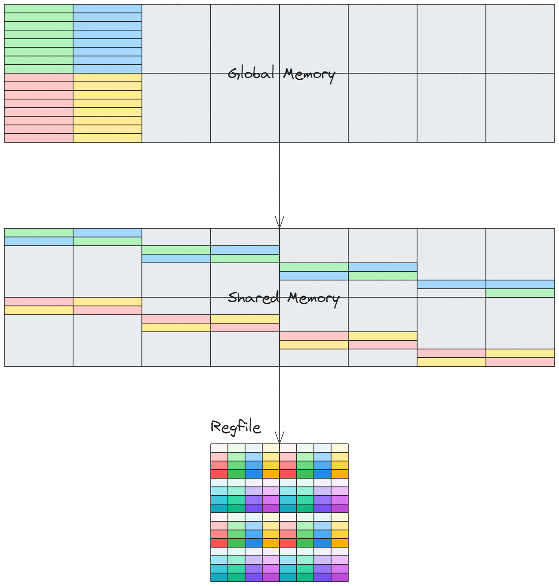
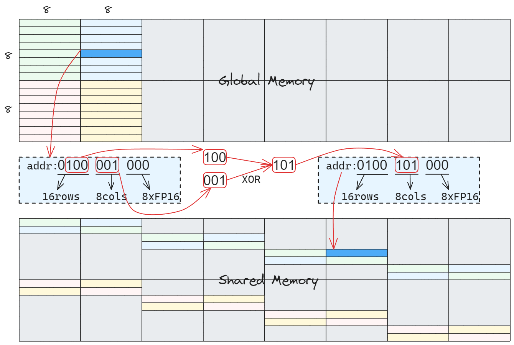
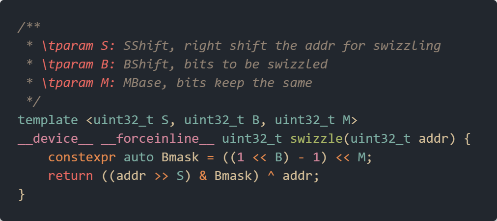
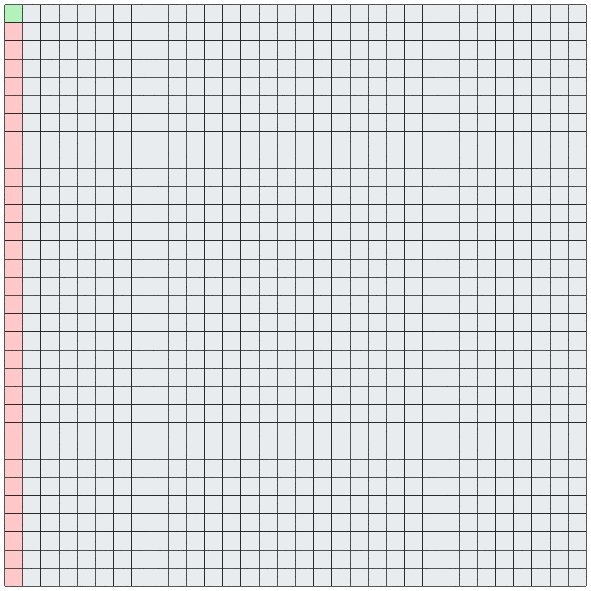
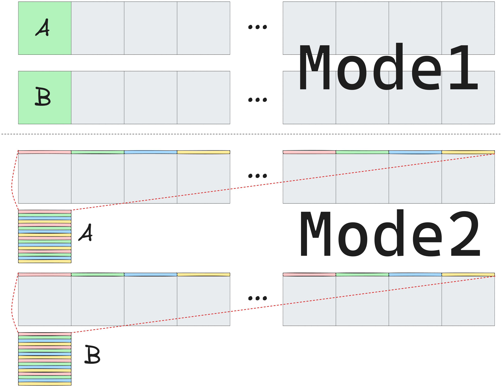

# 实用 Swizzle 教程（二）

实验仓库地址: https://github.com/Chtholly-Boss/swizzle

## 前言

在 [实用 Swizzle 教程（一）](./blog1.md) 中，笔者对 Swizzle 已进行了初步的探索。近几天，在笔者用 Swizzle 彻底消除了算子中的所有 LDSM/STS bank conflict 后，隐隐有飞升为算子仙人之感。于是乎，为了营造人人皆可 bank conflict free 的美好世界，本篇文章应运而生，针对如何自己进行 swizzle 抽象以及如何应用到多种共享内存访问模式的问题进行了些许探讨。

## 问题的产生

在 [实用 Swizzle 教程（一）](./blog1.md) 中，虽然我们已经了解到 swizzle 的基本思想，但在实现的过程中却采取了略微 dirty 的做法，即手动提取行/列偏移进行位运算。很自然地，我们便想要将其抽象为一个高效的函数以进行复用。

回顾上一篇文章给出的例子：

从上图中可以得知，swizzle 实质上解决了这么一个问题：

- 给定若干全局地址 `gAddr` (上图中 warp 内 32 个线程给出了 32 个地址)，如何映射到若干共享内存地址 `sAddr`，使得某种访问模式 `mode` (上图中即为访问一个 8x8 同色子块) 在共享内存中无 bank conflict

经过我们努力的探索后，该问题可用下面的话回答：

- 将各 `gAddr` 的 **不同之处** 作用到共享内存的 **bank 分布** 上即可

我亲爱的读者，你是否感到这个回答是 **make sense** 的呢？如果不是的话，请听我娓娓道来...

## Swizzle 抽象

我们重新关注一下上一篇文章中的地址映射过程：

注意，图中的地址实际上是一个 `FP16` 指针的偏移量。`8cols` 所表示的列实际上是一个 `8*2B=16B` 的 `bank4`，即由 4 个 4B 的 bank 形成的一个列。

从图中不难看出，由于我们的访问模式为 8x8 矩阵，我们便将 `gAddr` 的 行偏移作用到 `sAddr` 的列偏移上，使得表示 `bank4` 分布的列偏移位包含了 `gAddr` 的行信息，从而成功地将 8x8 矩阵的每一行分布到了不同的 `bank4` 上。

由此可以看出，在由 `gAddr` 形成 `sAddr` 时，我们关注一个地址的以下三部分：

- `MBase`: 表示一个块所需的位，上例中为 3，一个块有 8 个 `FP16`
- `BBits`: 表示 bank 分布的位，上例中为 3，即中间 3 位所表示的 `8cols`
- `SShift`: 包含 `gAddr` 信息的位移动到 `BBits` 的距离，用于映射 bank 分布 `BBits`

进而我们可以通过以下方式对 swizzle 进行抽象：

我们将三个参数作为模板参数以实现编译期计算，可以很好的利用 Cpp(ComPile time Programming) 的优势。可以看到，实际运行时仅有 `return` 处的开销，这部分 bit 操作笔者选择相信编译器。

**Elegant !!!** 我们成功地实现了属于自己的 swizzle。下面就让我们用这层抽象大杀四方吧桀桀桀~~~

## Mode

本部分我们将通过几个例子说明如何在实践中使用 swizzle，笔者相信这部分会很有意思（笑）。

### Column Access

第一个例子描述如下：

- 给定全局内存中的一个 FP32(float) 类型的 32x32 矩阵，Warp 内的 32 个线程需要频繁地访问同一列的 32 个元素。例如，对于每一列元素，将下一列元素加到其上方。

该问题图示如下：

很显然地，如果我们直接在共享内存中使用和全局内存一样的映射，每次访问时会有 31 次冲突，非常地恐怖。

让我们像 deepseek 一样也来思考一下...

> 嗯...共享内存 `float[32][32]` 的地址可以拆分成 `[xxxxx] [xxxxx] []` 分别表示行、列、块大小（此处为 1，不需要 bit）, 我们需要将同一列散布在不同的 bank 中，即 bank 分布包含行信息...我想到啦！

### Composite Swizzle

第二个例子描述如下：

- 给定全局内存中的两个 FP16 (half) 类型的 16x256 矩阵 A, B ，kernel 启动配置为 `<<<1, dim3(32,16)>>>`，即使用 16 个 warp 进行计算，现要求完成以下操作：
    - 以 16 列为单位，对于每个 16x16 矩阵块，使用 Tensor Core 进行矩阵乘法 `Csub = Asub * Bsub^T`
    - 将每一行的 256 个元素视为一个 16x16 矩阵块，使用 Tensor Core 进行矩阵乘法 `Csub = Asub * Bsub^T`
    - 在本例中，计算后不需要写回。读者可以考虑需要写回时的情形

该问题图示如下：

该问题涉及对于一个 16x16 矩阵进行 `ldmatrix` 加载的相关内容，不熟悉的读者可以绕道 [实用 Swizzle 教程（一）](./blog1.md) 复习一下。

这个问题的难点在于同时支持两种访问模式的无冲突访问，直觉较强的读者可能已经隐隐有得道飞升之感...

下面直接给出思路，具体代码读者可尝试自行实现。

参考实现可见 [实验仓库](https://github.com/Chtholly-Boss/swizzle) 的 `src/mma.cuh::mma_multi_pattern_swizzle` 函数

## 结语

**Congratulations!!!** 😆😆😆 相信读者们已经掌握了如何定义和使用自己的 swizzle，并能在 bank conflict free 的世界里尽情遨游啦。笔者认为，在现阶段的算子优化中，**swizzle** 已经成为了算子仙人们的必备法宝之一，这篇文章也旨在帮助初入门的工作者们理清相关概念和用法，希望能对大家有所帮助！
